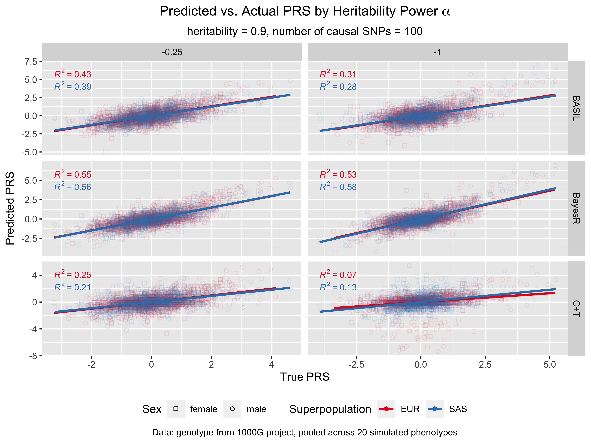
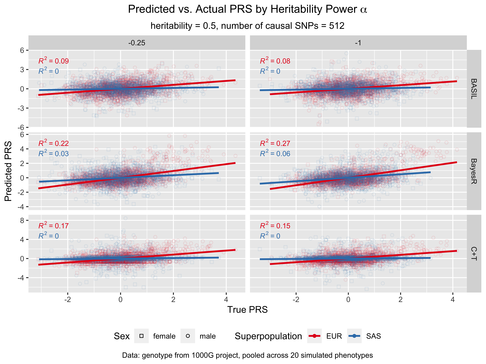
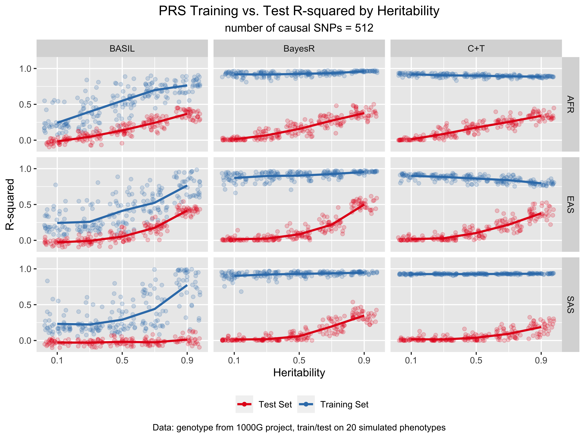

# Read in R^2 and prediction data


```r
paths = list(
    "C+T"    = here("data/CT/superpopulation/"),
    "BayesR" = here("data/BayesR/chr19_ldl_pheno/"),
    "BASIL"  = here("data/BASIL/chr19_ldl_pheno/")
)
result_files = list(
    "C+T"    = list.files(path=paths[["C+T"]], 
                          pattern=glob2rx("combined_result_*=1-20.csv")),
    "BayesR" = list.files(path=paths[["BayesR"]], 
                          pattern=glob2rx("combined_result_*=1-20.csv")),
    "BASIL"  = list.files(path=paths[["BASIL"]], 
                          pattern=glob2rx("combined_result_*=1-20.csv"))
)
predict_files = list(
    "C+T"    = list.files(path=paths[["C+T"]], 
                          pattern=glob2rx("combined_predict_*=1-20.csv")),
    "BayesR" = list.files(path=paths[["BayesR"]], 
                          pattern=glob2rx("combined_predict_*=1-20.csv")),
    "BASIL"  = list.files(path=paths[["BASIL"]], 
                          pattern=glob2rx("combined_predict_*=1-20.csv"))
)
result_df = rbind(
    read_csv(here(paths[["C+T"]], result_files[["C+T"]])) |>
        mutate(method="C+T", .before=`population/superpopulation`) |>
        select(-val),
    read_csv(here(paths[["BayesR"]], result_files[["BayesR"]])) |>
        mutate(method="BayesR", .before=`population/superpopulation`),
    read_csv(here(paths[["BASIL"]], result_files[["BASIL"]])) |>
        rename("population/superpopulation"=`population.superpopulation`) |>
        mutate(method="BASIL", .before=`population/superpopulation`) |>
        select(-val)
    )
result_df = result_df |>
    rename("superpop" = `population/superpopulation`)
result_df = result_df |>
    mutate(power = factor(power, levels=c("-0.25", "-1")),
           num_causals = factor(num_causals, levels=c("1", "10", "50", 
                                                      "100", "250", "512")),
           superpop = factor(superpop,
                             levels = c("AFR", "AMR", "EAS", "EUR", "SAS")))

normalit = function(m) {
    (m - mean(m))/sd(m)
}

predict_df = rbind(
        data.table::rbindlist(
        lapply(here(paths[["C+T"]], predict_files[["C+T"]]),
           function(x) {
               read_csv(file=x) |>
                   mutate(method="C+T", 
                          filename=tail(strsplit(x, split = "/")[[1]], 1), 
                          .before=`IID`) |>
                   mutate(actual = normalit(actual), 
                          predict = normalit(predict))
           })),
    data.table::rbindlist(
        lapply(here(paths[["BayesR"]], predict_files[["BayesR"]]),
           function(x) {
               read_csv(file=x) |>
                   mutate(method="BayesR", 
                          filename=tail(strsplit(x, split = "/")[[1]], 1), 
                          .before=`IID`) |>
                   mutate(actual = normalit(actual), 
                          predict = normalit(predict))
           })),
    data.table::rbindlist(
        lapply(here(paths[["BASIL"]], predict_files[["BASIL"]]),
           function(x) {
               read_csv(file=x) |>
                   mutate(method="BASIL", 
                          filename=tail(strsplit(x, split = "/")[[1]], 1), 
                          .before=`IID`) |>
                   mutate(actual = normalit(actual), 
                          predict = normalit(predict))
           }))
    )
predict_df = predict_df |>
    separate_wider_delim(cols=filename, delim = "_", 
                         names = c('combined', 'type', 'superpop', 'power', 
                                   'her', 'num-causals', 'pheno'))
predict_df = predict_df |>
    rename("num_causals" = `num-causals`) |>
    select(method, IID, predict, actual, superpop, power, her, num_causals, pheno_num)

igsr = read_tsv(here("data/igsr_samples.tsv")) |>
    rename("IID"=`Sample name`,
           "sex"=`Sex`,
           "pop"=`Population code`,
           "pop_name"=`Population name`) |>
    select(IID, sex, pop, pop_name)

predict_df = predict_df |>
    left_join(igsr, by="IID")

predict_df = predict_df |>
    mutate(power = str_replace(power, 'power=', ''),
           her = str_replace(her, 'her=', ''),
           num_causals = str_replace(num_causals, 'num-causals=', '')) |>
    mutate(power = factor(power, levels=c("-0.25", "-1")),
           her = factor(her, levels=c("0.1", "0.3", "0.5", "0.7", "0.9")),
           num_causals = factor(num_causals, levels=c("1", "10", "50", 
                                                      "100", "250", "512")),
           superpop = factor(superpop,
                             levels = c("AFR", "AMR", "EAS", "EUR", "SAS")))
```


# Scores by population and methods

## her=0.9, num-causals=512, power=-0.25


```r
ggplot(predict_df |>
           filter(her=="0.9", 
                  num_causals=="512", 
                  power=="-0.25"),
       aes(x=actual, y=predict, color=superpop)) +
    geom_point(alpha=0.2, aes(shape=sex)) +
    geom_smooth(method = "lm", alpha=0.3, color="black") +
    stat_cor(aes(label = ..rr.label..), 
             label.x.npc = "left",
             label.y.npc = "top",
             output.type = "expression",
             color = "black",
             size = 3) +
    scale_shape_manual(name="Sex",
                       values=c(0,1,2,5,6)) +
    scale_color_brewer(name="Superpopulation",
                       palette="Set1") +
    # scale_colour_hue(l = 70, c = 150) +
    ggtitle("Predicted vs. Actual PRS by Superpopulation",
            subtitle="heritability = 0.9, number of causal SNPs = 512, \u03B1 = -0.25") +
    xlab("True PRS") + 
    ylab("Predicted PRS") +
    labs(caption = "Data: genotype from 1000G project, pooled across 20 simulated phenotypes") +
    # theme(legend.position="none",
    #       plot.title = element_text(hjust = 0.5),
    #       plot.subtitle = element_text(hjust = 0.5)) +
    theme(legend.position="bottom",
          plot.title = element_text(hjust = 0.5),
          plot.subtitle = element_text(hjust = 0.5),
          plot.caption = element_text(hjust = 0.5)) +
    facet_grid(rows = vars(method),
               cols = vars(superpop),
               scales = "free")+
  guides(color = guide_legend(override.aes = list(alpha=1)),
         shape = guide_legend(override.aes = list(alpha=1)))
```


## her=0.9, num-causals=512, power=-1


```r
ggplot(predict_df |>
           filter(her=="0.9", 
                  num_causals=="512", 
                  power=="-1"),
       aes(x=actual, y=predict, color=superpop)) +
    geom_point(alpha=0.2, aes(shape=sex)) +
    geom_smooth(method = "lm", alpha=0.3, color="black") +
    stat_cor(aes(label = ..rr.label..), 
             label.x.npc = "left",
             label.y.npc = "top",
             output.type = "expression",
             color = "black",
             size = 3) +
    scale_shape_manual(name="Sex",
                       values=c(0,1,2,5,6)) +
    scale_color_brewer(name="Superpopulation",
                       palette="Set1") +
    # scale_colour_hue(l = 70, c = 150) +
    ggtitle("Predicted vs. Actual PRS by Superpopulation",
            subtitle="heritability = 0.9, number of causal SNPs = 512, \u03B1 = -1") +
    xlab("True PRS") + 
    ylab("Predicted PRS") +
    labs(caption = "Data: genotype from 1000G project, pooled across 20 simulated phenotypes") +
    # theme(legend.position="none",
    #       plot.title = element_text(hjust = 0.5),
    #       plot.subtitle = element_text(hjust = 0.5)) +
    theme(legend.position="bottom",
          plot.title = element_text(hjust = 0.5),
          plot.subtitle = element_text(hjust = 0.5),
          plot.caption = element_text(hjust = 0.5)) +
    facet_grid(rows = vars(method),
               cols = vars(superpop),
               scales = "free")+
  guides(color = guide_legend(override.aes = list(alpha=1)),
         shape = guide_legend(override.aes = list(alpha=1)))
```


# Scores by heritability and methods

## num-causals=512 in EUR and SAS


```r
ggplot(predict_df |>
           filter(
               superpop %in% c("EUR", "SAS"),
               num_causals=="512",
               power=="-0.25"),
       aes(x=actual, y=predict, color=superpop)) +
    geom_point(alpha=0.1, aes(shape=sex)) +
    geom_smooth(aes(color = superpop),
                method = "lm", alpha=0.3, se=FALSE) +
    stat_cor(aes(group = superpop,
                 label = ..rr.label..), 
             label.x.npc = "left",
             label.y.npc = "top",
             output.type = "expression",
             r.accuracy = 0.01,
             size = 3,
             show.legend = FALSE) +
    scale_shape_manual(name="Sex",
                       values=c(0,1,2,5,6)) +
    scale_color_brewer(name="Superpopulation",
                       palette="Set1") +
    # scale_colour_hue(l = 70, c = 150) +
    ggtitle("Predicted vs. Actual PRS by Heritability",
            subtitle="number of causal SNPs = 512, \u03B1 = -0.25") +
    xlab("True PRS") + 
    ylab("Predicted PRS") +
    labs(caption = "Data: genotype from 1000G project, pooled across 20 simulated phenotypes") +
    # theme(legend.position="none",
    #       plot.title = element_text(hjust = 0.5),
    #       plot.subtitle = element_text(hjust = 0.5)) +
    theme(legend.position="bottom",
          plot.title = element_text(hjust = 0.5),
          plot.subtitle = element_text(hjust = 0.5),
          plot.caption = element_text(hjust = 0.5)) +
    facet_grid(rows = vars(method),
               cols = vars(her),
               scales = "free") +
  guides(color = guide_legend(override.aes = list(alpha=1)),
         shape = guide_legend(override.aes = list(alpha=1)))
```


## num-causals=512 in EUR


```r
ggplot(predict_df |>
           filter(
               superpop %in% c("EUR"),
               num_causals=="512",
               power=="-0.25"),
       aes(x=actual, y=predict, color=superpop)) +
    geom_point(alpha=0.1, aes(shape=sex)) +
    geom_smooth(color="black",
                method = "lm", alpha=0.3, se=FALSE) +
    stat_cor(aes(group = superpop,
                 label = ..rr.label..), 
             label.x.npc = "left",
             label.y.npc = "top",
             output.type = "expression",
             r.accuracy = 0.01,
             size = 3,
             show.legend = FALSE) +
    scale_shape_manual(name="Sex",
                       values=c(0,1,2,5,6)) +
    scale_color_manual(name="Superpopulation",
                       values = RColorBrewer::brewer.pal(5, "Set1")[4]) +
    # scale_colour_hue(l = 70, c = 150) +
    ggtitle("Predicted vs. Actual PRS by Heritability",
            subtitle="number of causal SNPs = 512, \u03B1 = -0.25") +
    xlab("True PRS") + 
    ylab("Predicted PRS") +
    labs(caption = "Data: genotype from 1000G project, pooled across 20 simulated phenotypes") +
    # theme(legend.position="none",
    #       plot.title = element_text(hjust = 0.5),
    #       plot.subtitle = element_text(hjust = 0.5)) +
    theme(legend.position="bottom",
          plot.title = element_text(hjust = 0.5),
          plot.subtitle = element_text(hjust = 0.5),
          plot.caption = element_text(hjust = 0.5)) +
    facet_grid(rows = vars(method),
               cols = vars(her),
               scales = "free") +
  guides(color = guide_legend(override.aes = list(alpha=1)),
         shape = guide_legend(override.aes = list(alpha=1)))
```


## num-causals=512 in EAS


```r
ggplot(predict_df |>
           filter(
               superpop %in% c("EAS"),
               num_causals=="512",
               power=="-1"),
       aes(x=actual, y=predict, color=superpop)) +
    geom_point(alpha=0.1, aes(shape=sex)) +
    geom_smooth(color="black",
                method = "lm", alpha=0.3, se=FALSE) +
    stat_cor(aes(group = superpop,
                 label = ..rr.label..), 
             label.x.npc = "left",
             label.y.npc = "top",
             output.type = "expression",
             r.accuracy = 0.01,
             size = 3,
             show.legend = FALSE) +
    scale_shape_manual(name="Sex",
                       values=c(0,1,2,5,6)) +
    scale_color_manual(name="Superpopulation",
                       values = RColorBrewer::brewer.pal(5, "Set1")[3]) +
    # scale_colour_hue(l = 70, c = 150) +
    ggtitle("Predicted vs. Actual PRS by Heritability",
            subtitle="number of causal SNPs = 512, \u03B1 = -0.25") +
    xlab("True PRS") + 
    ylab("Predicted PRS") +
    labs(caption = "Data: genotype from 1000G project, pooled across 20 simulated phenotypes") +
    # theme(legend.position="none",
    #       plot.title = element_text(hjust = 0.5),
    #       plot.subtitle = element_text(hjust = 0.5)) +
    theme(legend.position="bottom",
          plot.title = element_text(hjust = 0.5),
          plot.subtitle = element_text(hjust = 0.5),
          plot.caption = element_text(hjust = 0.5)) +
    facet_grid(rows = vars(method),
               cols = vars(her),
               scales = "free") +
  guides(color = guide_legend(override.aes = list(alpha=1)),
         shape = guide_legend(override.aes = list(alpha=1)))
```


# Scores by number of causal SNPs and methods


```r
ggplot(predict_df |>
           filter(
               num_causals %in% c("1", "10", "100", "512"),
               superpop %in% c("EUR", "SAS"),
               her=="0.9",
               power=="-0.25"),
       aes(x=actual, y=predict, color=superpop)) +
    geom_point(alpha=0.1, aes(shape=sex)) +
    geom_smooth(aes(color = superpop),
                method = "lm", alpha=0.3, se=FALSE) +
    stat_cor(aes(group = superpop,
                 label = ..rr.label..), 
             label.x.npc = "left",
             label.y.npc = "top",
             output.type = "expression",
             r.accuracy = 0.01,
             size = 3,
             show.legend = FALSE) +
    scale_shape_manual(name="Sex",
                       values=c(0,1,2,5,6)) +
    scale_color_brewer(name="Superpopulation",
                       palette="Set1") +
    # scale_colour_hue(l = 70, c = 150) +
    ggtitle("Predicted vs. Actual PRS by Number of Causal SNPs",
            subtitle="heritability = 0.9, \u03B1 = -0.25") +
    xlab("True PRS") + 
    ylab("Predicted PRS") +
    labs(caption = "Data: genotype from 1000G project, pooled across 20 simulated phenotypes") +
    # theme(legend.position="none",
    #       plot.title = element_text(hjust = 0.5),
    #       plot.subtitle = element_text(hjust = 0.5)) +
    theme(legend.position="bottom",
          plot.title = element_text(hjust = 0.5),
          plot.subtitle = element_text(hjust = 0.5),
          plot.caption = element_text(hjust = 0.5)) +
    facet_grid(rows = vars(method),
               cols = vars(num_causals),
               scales = "free") +
  guides(color = guide_legend(override.aes = list(alpha=1)),
         shape = guide_legend(override.aes = list(alpha=1)))
```


```r
ggplot(predict_df |>
           filter(
               num_causals %in% c("1", "10", "100", "512"),
               superpop %in% c("EUR", "SAS"),
               her=="0.5",
               power=="-0.25"),
       aes(x=actual, y=predict, color=superpop)) +
    geom_point(alpha=0.1, aes(shape=sex)) +
    geom_smooth(aes(color = superpop),
                method = "lm", alpha=0.3, se=FALSE) +
    stat_cor(aes(group = superpop,
                 label = ..rr.label..), 
             label.x.npc = "left",
             label.y.npc = "top",
             output.type = "expression",
             r.accuracy = 0.01,
             size = 3,
             show.legend = FALSE) +
    scale_shape_manual(name="Sex",
                       values=c(0,1,2,5,6)) +
    scale_color_brewer(name="Superpopulation",
                       palette="Set1") +
    # scale_colour_hue(l = 70, c = 150) +
    ggtitle("Predicted vs. Actual PRS by Number of Causal SNPs",
            subtitle="heritability = 0.5, \u03B1 = -0.25") +
    xlab("True PRS") + 
    ylab("Predicted PRS") +
    labs(caption = "Data: genotype from 1000G project, pooled across 20 simulated phenotypes") +
    # theme(legend.position="none",
    #       plot.title = element_text(hjust = 0.5),
    #       plot.subtitle = element_text(hjust = 0.5)) +
    theme(legend.position="bottom",
          plot.title = element_text(hjust = 0.5),
          plot.subtitle = element_text(hjust = 0.5),
          plot.caption = element_text(hjust = 0.5)) +
    facet_grid(rows = vars(method),
               cols = vars(num_causals),
               scales = "free") +
  guides(color = guide_legend(override.aes = list(alpha=1)),
         shape = guide_legend(override.aes = list(alpha=1)))
```


```r
ggplot(predict_df |>
           filter(
               num_causals %in% c("1", "10", "100", "512"),
               superpop %in% c("EUR", "SAS"),
               her=="0.1",
               power=="-0.25"),
       aes(x=actual, y=predict, color=superpop)) +
    geom_point(alpha=0.1, aes(shape=sex)) +
    geom_smooth(aes(color = superpop),
                method = "lm", alpha=0.3, se=FALSE) +
    stat_cor(aes(group = superpop,
                 label = ..rr.label..), 
             label.x.npc = "left",
             label.y.npc = "top",
             output.type = "expression",
             r.accuracy = 0.01,
             size = 3,
             show.legend = FALSE) +
    scale_shape_manual(name="Sex",
                       values=c(0,1,2,5,6)) +
    scale_color_brewer(name="Superpopulation",
                       palette="Set1") +
    # scale_colour_hue(l = 70, c = 150) +
    ggtitle("Predicted vs. Actual PRS by Number of Causal SNPs",
            subtitle="heritability = 0.1, \u03B1 = -0.25") +
    xlab("True PRS") + 
    ylab("Predicted PRS") +
    labs(caption = "Data: genotype from 1000G project, pooled across 20 simulated phenotypes") +
    # theme(legend.position="none",
    #       plot.title = element_text(hjust = 0.5),
    #       plot.subtitle = element_text(hjust = 0.5)) +
    theme(legend.position="bottom",
          plot.title = element_text(hjust = 0.5),
          plot.subtitle = element_text(hjust = 0.5),
          plot.caption = element_text(hjust = 0.5)) +
    facet_grid(rows = vars(method),
               cols = vars(num_causals),
               scales = "free") +
  guides(color = guide_legend(override.aes = list(alpha=1)),
         shape = guide_legend(override.aes = list(alpha=1)))
```


# Scores by power and methods


```r
ggplot(predict_df |>
           filter(
               num_causals %in% c("100"),
               superpop %in% c("EUR", "SAS"),
               her=="0.9"),
       aes(x=actual, y=predict, color=superpop)) +
    geom_point(alpha=0.1, aes(shape=sex)) +
    geom_smooth(aes(color = superpop),
                method = "lm", alpha=0.3, se=FALSE) +
    stat_cor(aes(group = superpop,
                 label = ..rr.label..), 
             label.x.npc = "left",
             label.y.npc = "top",
             output.type = "expression",
             r.accuracy = 0.01,
             size = 3,
             show.legend = FALSE) +
    scale_shape_manual(name="Sex",
                       values=c(0,1,2,5,6)) +
    scale_color_brewer(name="Superpopulation",
                       palette="Set1") +
    # scale_colour_hue(l = 70, c = 150) +
    ggtitle(expression(paste("Predicted vs. Actual PRS by Heritability Power ", alpha)),
            subtitle="heritability = 0.9, number of causal SNPs = 100") +
    xlab("True PRS") + 
    ylab("Predicted PRS") +
    labs(caption = "Data: genotype from 1000G project, pooled across 20 simulated phenotypes") +
    # theme(legend.position="none",
    #       plot.title = element_text(hjust = 0.5),
    #       plot.subtitle = element_text(hjust = 0.5)) +
    theme(legend.position="bottom",
          plot.title = element_text(hjust = 0.5),
          plot.subtitle = element_text(hjust = 0.5),
          plot.caption = element_text(hjust = 0.5)) +
    facet_grid(rows = vars(method),
               cols = vars(power),
               scales = "free") +
  guides(color = guide_legend(override.aes = list(alpha=1)),
         shape = guide_legend(override.aes = list(alpha=1)))
```




```r
ggplot(predict_df |>
           filter(
               num_causals %in% c("512"),
               superpop %in% c("EUR", "SAS"),
               her=="0.5"),
       aes(x=actual, y=predict, color=superpop)) +
    geom_point(alpha=0.1, aes(shape=sex)) +
    geom_smooth(aes(color = superpop),
                method = "lm", alpha=0.3, se=FALSE) +
    stat_cor(aes(group = superpop,
                 label = ..rr.label..), 
             label.x.npc = "left",
             label.y.npc = "top",
             output.type = "expression",
             r.accuracy = 0.01,
             size = 3,
             show.legend = FALSE) +
    scale_shape_manual(name="Sex",
                       values=c(0,1,2,5,6)) +
    scale_color_brewer(name="Superpopulation",
                       palette="Set1") +
    # scale_colour_hue(l = 70, c = 150) +
    ggtitle(expression(paste("Predicted vs. Actual PRS by Heritability Power ", alpha)),
            subtitle="heritability = 0.5, number of causal SNPs = 512") +
    xlab("True PRS") + 
    ylab("Predicted PRS") +
    labs(caption = "Data: genotype from 1000G project, pooled across 20 simulated phenotypes") +
    # theme(legend.position="none",
    #       plot.title = element_text(hjust = 0.5),
    #       plot.subtitle = element_text(hjust = 0.5)) +
    theme(legend.position="bottom",
          plot.title = element_text(hjust = 0.5),
          plot.subtitle = element_text(hjust = 0.5),
          plot.caption = element_text(hjust = 0.5)) +
    facet_grid(rows = vars(method),
               cols = vars(power),
               scales = "free") +
  guides(color = guide_legend(override.aes = list(alpha=1)),
         shape = guide_legend(override.aes = list(alpha=1)))
```



# Result by heritability and methods

## num-causals=512, train and test


```r
# colors <- c("Train" = RColorBrewer::brewer.pal(5, "Set1")[1], 
#             "Test" = RColorBrewer::brewer.pal(5, "Set1")[2])
ggplot(result_df |>
           filter(num_causals=="512",
                  superpop != "AMR" & superpop != "EUR"),
       aes(x=her)) +
    geom_jitter(alpha=0.2,
                aes(y=train, color="Training Set")) + 
    geom_jitter(alpha=0.2,
                aes(y=test, color="Test Set")) + 
    stat_summary(aes(y=train, color="Training Set"),
                 fun.y=mean, geom = 'line', linewidth=1) +
    stat_summary(aes(y=test, color="Test Set"),
                 fun.y=mean, geom = 'line', linewidth=1) +
    scale_color_brewer(name="",
                       palette="Set1") +
    facet_grid(rows = vars(superpop),
               cols = vars(method)) +
    ggtitle("PRS Training vs. Test R-squared by Heritability",
            subtitle="number of causal SNPs = 512") +
    xlab("Heritability") + 
    ylab("R-squared") +
    labs(color = "") +
    scale_y_continuous(limits = c(-0.1, 1.1),
                       breaks = c(0, 0.5, 1)) +
    scale_x_continuous(breaks = c(0.1, 0.5, 0.9),
                       labels = c("0.1", "0.5", "0.9")) +
    labs(caption = "Data: genotype from 1000G project, train/test on 20 simulated phenotypes") +
    # theme(legend.position="none",
    #       plot.title = element_text(hjust = 0.5),
    #       plot.subtitle = element_text(hjust = 0.5)) +
    theme(legend.position="bottom",
          plot.title = element_text(hjust = 0.5),
          plot.subtitle = element_text(hjust = 0.5),
          plot.caption = element_text(hjust = 0.5)) +
  guides(color = guide_legend(override.aes = list(alpha=1)),
         shape = guide_legend(override.aes = list(alpha=1)))
```




## num-causals=512, test only


```r
# colors <- c("Train" = RColorBrewer::brewer.pal(5, "Set1")[1], 
#             "Test" = RColorBrewer::brewer.pal(5, "Set1")[2])
ggplot(result_df |>
           filter(num_causals=="512",
                  superpop != "AMR" & superpop != "EUR"),
       aes(x=her)) +
    # geom_jitter(alpha=0.2,
    #             aes(y=train, color="Training Set")) + 
    geom_jitter(alpha=0.2,
                aes(y=test, color="Test Set")) + 
    # stat_summary(aes(y=train, color="Training Set"),
    #              fun.y=mean, geom = 'line', linewidth=1) +
    stat_summary(aes(y=test, color="Test Set"),
                 fun.y=mean, geom = 'line', linewidth=1) +
    scale_color_brewer(name="",
                       palette="Set1") +
    facet_grid(rows = vars(superpop),
               cols = vars(method)) +
    ggtitle("PRS Test R-squared by Heritability",
            subtitle="number of causal SNPs = 512") +
    xlab("Heritability") + 
    ylab("R-squared") +
    labs(color = "") +
    scale_y_continuous(limits = c(-0.1, 1.1),
                       breaks = c(0, 0.5, 1)) +
    scale_x_continuous(breaks = c(0.1, 0.5, 0.9),
                       labels = c("0.1", "0.5", "0.9")) +
    labs(caption = "Data: genotype from 1000G project, train/test on 20 simulated phenotypes") +
    # theme(legend.position="none",
    #       plot.title = element_text(hjust = 0.5),
    #       plot.subtitle = element_text(hjust = 0.5)) +
    theme(legend.position="bottom",
          plot.title = element_text(hjust = 0.5),
          plot.subtitle = element_text(hjust = 0.5),
          plot.caption = element_text(hjust = 0.5)) +
  guides(color = guide_legend(override.aes = list(alpha=1)),
         shape = guide_legend(override.aes = list(alpha=1)))
```


# Result by number of causal SNPs and methods

## 


```r
# colors <- c("Train" = RColorBrewer::brewer.pal(5, "Set1")[1], 
#             "Test" = RColorBrewer::brewer.pal(5, "Set1")[2])
ggplot(result_df |>
           filter(num_causals %in% c("1", "10", "100", "512")),
       aes(x=her)) +
    # geom_jitter(alpha=0.2,
    #             aes(y=train, color="Training Set")) + 
    geom_jitter(alpha=0.1,
                aes(y=test, color=superpop)) + 
    # stat_summary(aes(y=train, color="Training Set"),
    #              fun.y=mean, geom = 'line', linewidth=1) +
    stat_summary(aes(y=test, color=superpop),
                 fun.y=mean, geom = 'line', linewidth=1,
                 alpha=0.8) +
    scale_color_brewer(name="Superpopulation",
                       palette="Set1") +
    facet_grid(rows = vars(num_causals),
               cols = vars(method)) +
    ggtitle("PRS Test R-squared by Heritability & Number of Causal SNPs") +
    xlab("Heritability") + 
    ylab("Test R-squared") +
    labs(color = "") +
    scale_y_continuous(limits = c(-0.1, 0.7),
                       breaks = c(0, 0.3, 0.6)) +
    scale_x_continuous(breaks = c(0.1, 0.5, 0.9),
                       labels = c("0.1", "0.5", "0.9")) +
    labs(caption = "Data: genotype from 1000G project, train/test on 20 simulated phenotypes") +
    # theme(legend.position="none",
    #       plot.title = element_text(hjust = 0.5),
    #       plot.subtitle = element_text(hjust = 0.5),
    #       plot.caption = element_text(hjust = 0.5)) +
    theme(legend.position="bottom",
          plot.title = element_text(hjust = 0.5),
          plot.subtitle = element_text(hjust = 0.5),
          plot.caption = element_text(hjust = 0.5)) +
  guides(color = guide_legend(override.aes = list(alpha=1)),
         shape = guide_legend(override.aes = list(alpha=1)))
```


